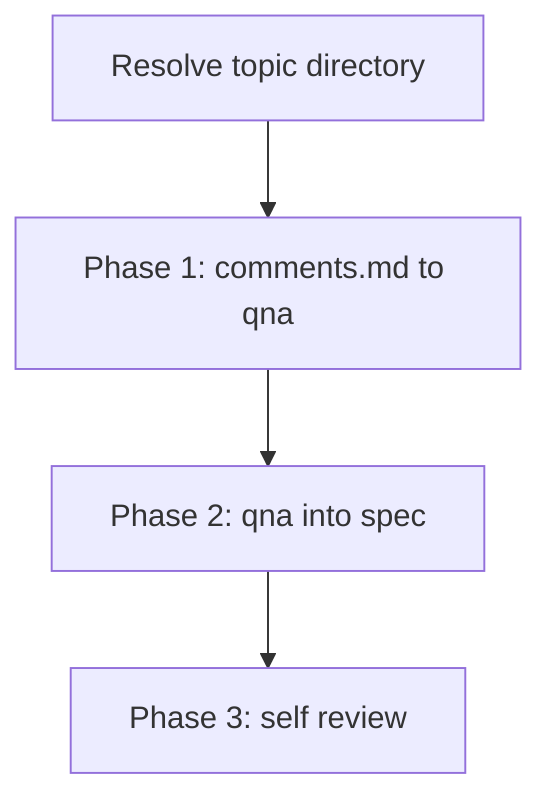

# spec-refine (fold comments and Q&A back into the spec)

Take an **existing** topic directory under `docs/plans/`—the layout produced by **`spec-start`**—and bring it up to date: absorb `comments.md`, reconcile `qna.md`, refresh `spec.md`, then self-review. This is **documentation only** inside that directory (plus an optional git commit only if the caller explicitly asked to commit).

Do **not** write production code, scaffold projects, or invoke implementation skills.

## Delegation and subagents

Long `spec.md` bodies, broad repo research, or many `comments.md` sections can consume main-agent context quickly. **Parallel reasoning is fine; parallel writers on the same file are not.**

- **Orchestrator (main agent):** Resolves the **topic directory**, applies **all** edits to `spec.md`, `qna.md`, and `comments.md`, runs **Phase 3 self-review**, and owns the final message to the user.
- **Subagents (optional):** Use for **narrow** work units—one independent `comments.md` section (or one **thread** of sections that explicitly reference each other), or one `## Q-NN` whose integration needs deep repo search. Each subagent returns a **short summary** and **proposed edits** (what to append or remove, with exact text where possible). The orchestrator **merges** those proposals; subagents do **not** patch the same Markdown file concurrently.
- **Bounded reads:** Prefer headings, line ranges cited in comments, and targeted search over pasting entire large files repeatedly.

For **`qna.md` grammar** and **self-review depth**, stay aligned with **`spec-start`** (flat `## Q-NN`, `###` answers, chronology).

## Resolve the topic directory

Paths are **relative to the topic directory** once resolved.

1. Infer the directory from the user message and repo context. Convention: `docs/plans/YYYY-MM-DD-<topic>/` (same as **`spec-start`**).
2. If **multiple** candidates match or none is identifiable, **stop** and report an error—do **not** guess.

The directory **must** already contain `spec.md` and `qna.md`. Optional: `comments.md`.

## Process overview

## Phase 1 — `comments.md` (optional)

Skip this phase if `comments.md` is **missing**.

### Comment file shape

Reviewers may structure `comments.md` as **multiple** top-level sections. Typical patterns (examples—not an exhaustive grammar):

- Optional `#` title (for example `# Comments`).
- **`## …`** for each comment block. A title line may include optional attribution, for example **## General note — @handle**.
- **## For question Q-03** — text targets question **Q-03** in `qna.md`.
- **## For file spec.md lines 30** — text targets a location in `spec.md` (line numbers are hints; reconcile with current file content).

### Merge into `qna.md` first when applicable

1. For sections that clearly map to **`## Q-NN`** in `qna.md`, append new **`### Answer — …`** children under that question using the same rules as **`spec-start`**: **unique slug text** in each `###` heading; **oldest answer first, newest last** under the same `## Q-NN`; permalink on the line under the heading when long.
2. **Consume** comment text as you fold it in: remove passages from `comments.md` once their substance lives under the right `###` (or is clearly obsolete). Remove a whole **`## …`** section when nothing usable remains in it.
3. **Later vs earlier:** When two comments conflict, treat **later** sections in file order as **overriding** earlier ones unless the earlier text is still needed for traceability—then capture the tension in a new **`### Answer — …`** noting the override.

### Remaining general comments

For text that does **not** map cleanly to an existing `## Q-NN`:

- Apply edits to **`spec.md`** when the comment is design-level, or
- Add new **`## Q-NN`** rows to **`qna.md`** when clarification is still needed. Assign the next IDs after the current maximum (`Q-01` … two-digit style; continue with `Q-10`, `Q-11`, … as needed).

### Parallelization

For independent sections, you **may** **dispatch a subagent** per section (or per thread of mutually referring sections) to draft summaries and proposed `qna.md` / `spec.md` edits. The orchestrator applies merges **in document order** within `comments.md` when order matters for overrides.

## Phase 2 — `qna.md` → `spec.md`

For each **`## Q-NN`** in order:

1. Read the question bullets and **all** `###` answers.
2. If the thread **fully resolves** the question, update **`spec.md`** so the canonical design matches the decision. Remove or rewrite **overruled** implementation options so the spec does not read like a menu of dead paths—capture discarded options briefly in `qna.md` if historical trace matters (**new `###`** or **Kind**-appropriate update).
3. If the thread is **only partially** resolved, still fold **confirmed** facts into `spec.md`. When it helps reviewers, append a **`### Answer — …`** (synthesis) that states what remains open, who might decide it, and risks—**without** blocking the run on live Q&A with the user.
4. For heavy integration (large codebase, cross-cutting research), **dispatch a subagent** per `## Q-NN` if useful; the orchestrator applies the summarized proposal to `spec.md` and any new `###` / `## Q-NN` entries.

Keep **`spec.md`** as the **canonical** design surface; keep debate and attribution in **`qna.md`** where it belongs.

## Phase 3 — Spec self-review

Re-run the same quality bar as **`spec-start`** (“Spec self-review”):

1. **Placeholder scan:** Any "TBD", "TODO", vague requirements? Fix in `spec.md` or track in `qna.md` as `## Q-NN` with explicit uncertainty.
2. **Internal consistency:** Sections agree; architecture matches behavior; `spec.md` and `qna.md` agree. Mermaid and links still parse; paths resolve.
3. **Scope check:** Single coherent implementation plan or explicit decomposition in `qna.md`.
4. **Ambiguity check:** No requirement readable two ways without a recorded call in `spec.md` or `qna.md`.
5. **`qna.md` shape:** Stable **`Q-NN`** IDs in order; real answers use unique `###` slugs; chronology preserved.

Fix issues inline. One pass is enough unless edits reintroduce problems.

## `comments.md` lifecycle after Phase 1

When **no** pending comment text remains, **delete `comments.md`** so the topic directory does not carry empty review scratch space. If your tooling or team policy forbids deletion, leave a single-line file stating there are no pending comments—prefer deletion when allowed.

## Commit

Commit only if the user or automation **explicitly** asked to commit. Otherwise leave changes in the working tree and report paths.

For **GitHub PR round-trips** (ingest PR review comments, commit `spec.md` / `qna.md` to the PR branch, optional push and thread replies), use **`spec-refine-github`** instead of relying on this skill alone—it owns `gh`, PR-scoped eligibility, and harness vs local writes.

## Aftercare (message to user)

In the final reply, list the **topic directory path**, summarize **what changed** in `spec.md`, `qna.md`, and `comments.md` (including deletion), and surface the **top** remaining `## Q-NN` items that still need human decisions (**Kind:** `open`, or high blast-radius assumptions).

If the work was driven from a **spec PR** and you need push/thread-reply automation, point the user at **`spec-refine-github`** for the next step.
