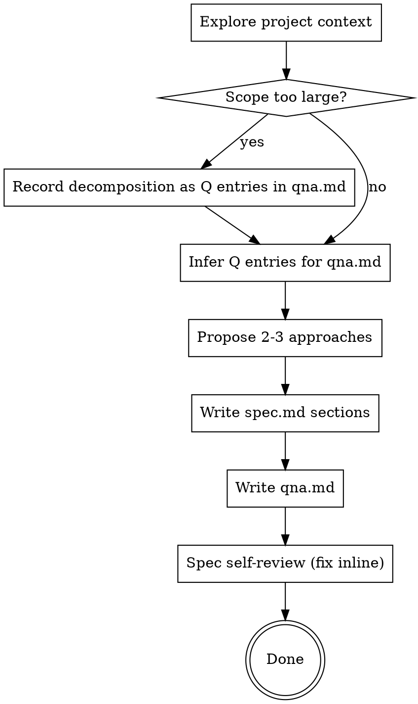

# spec-start (headless spec kickoff)

For **GitHub issue as canonical prompt** (fetch issue, `agent/<n>-spec-*` branch, local or harness PR), use **`spec-start-github`** together with this skill.

Help turn ideas into fully formed designs and specs **without** natural collaborative dialogue: run **once**, infer missing intent from the prompt and repo, and **write** the results to disk.

Start by understanding the current project context (files, docs, recent commits). **Do not** ask questions one at a time or wait for approval between sections—when something is unclear, **capture it** in `qna.md` as `## Q-NN` entries (see **`qna.md` format** below).

## Hard-gate (spec-start)

Do **not** invoke any implementation skill, write production code, scaffold a project, or take any implementation action. Output is **documentation only** inside the topic directory (plus an optional git commit only if the caller explicitly asked to commit).

This applies to every run regardless of perceived simplicity.

## Anti-pattern: "This Is Too Simple To Need A Design"

Every topic deserves the same discipline. A todo list, a single-function utility, a config change — all of them. "Simple" topics are where unexamined assumptions cause the most wasted work. The design can be short (a few sentences for truly straightforward topics), but you **must** still produce `spec.md` and `qna.md`, scaled to complexity.

## Checklist (headless mapping)

You **must** complete these in order. Treat them as a single uninterrupted pass—**no** blocking `AskQuestion`, no "approve this section," no mid-run wait for the user.

1. **Explore project context** — check files, docs, recent commits relevant to the prompt; follow existing repo structure and naming.
2. **Assess scope** — if the request describes multiple independent subsystems (for example chat, file storage, billing, and analytics in one prompt), **flag it immediately** in `qna.md` as one or more `## Q-NN` entries with **Kind:** `decomposition` or `scope` (independent pieces, how they relate, suggested build order). Do not silently narrow scope without recording that in `qna.md`.
3. **Resolve "clarifying questions" without the user** — for anything you would normally ask one at a time (purpose, constraints, success criteria), **infer** the best answer from context and record it in `qna.md` as `## Q-NN` entries (use **Kind:** `assumption` with confidence and blast radius, or **Kind:** `open` when inference is too weak). Prefer multiple-choice style reasoning internally; do not paste quiz questions to the user.
4. **Propose 2–3 approaches** — with trade-offs and your recommendation; lead with the recommended option and explain why.
5. **Write the design** — in sections scaled to complexity (see **Presenting the design** below), **directly into** `spec.md` (no separate "chat" design pass).
6. **Write Q&A** — `qna.md` as a flat list of `## Q-NN` entries (see **`qna.md` format**). Include **example `###` answer headings only under `Q-01`**; other questions stay bullet-only until real discussion adds answers.
7. **Spec self-review** — quick inline check for placeholders, contradictions, ambiguity, scope (see **Spec self-review** below). Fix issues inline before finishing.
8. **Stop** — do not auto-invoke planning or implementation skills. Optionally note that a follow-up session may produce an implementation plan once reviewers have read `qna.md` (and any review artifacts other skills add later, such as `comments.md`). When reviewers add `comments.md`, use **`spec-refine`** to fold that feedback into `spec.md` and `qna.md`.

## Process flow (headless)



## The process

### Understanding the idea

- Check out the current project state first (files, docs, recent commits).
- Before simulating "detailed questions," assess scope: if the request bundles several independent subsystems, say so up front in `qna.md` using `## Q-NN` entries (**Kind:** `decomposition` or `scope`) and outline how to split work. If the project is too large for one coherent spec, still produce one `spec.md` for the slice you can cover, and make the boundary explicit in `qna.md`.
- For appropriately-scoped topics, **internally** focus on purpose, constraints, and success criteria; express conclusions in `spec.md` and uncertainties as `## Q-NN` rows in `qna.md`.

### Exploring approaches

- Propose **2–3** different approaches with trade-offs.
- Present options with your recommendation and reasoning.
- Lead with your recommended option and explain why.

### Presenting the design (written, not interactive)

- Once you have a working picture of what is being built, write the design into `spec.md`.
- Scale each section to its complexity: a few sentences if straightforward, more if nuanced (on the order of a couple hundred words per heavy section when needed).
- **Do not** ask after each section whether it looks right; instead, use self-review and `qna.md` to catch gaps.
- Cover, as applicable: architecture, components, data flow, error handling, testing.

### Design for isolation and clarity

- Break the system into smaller units that each have one clear purpose, communicate through well-defined interfaces, and can be understood and tested independently.
- For each unit, you should be able to answer: what does it do, how do you use it, and what does it depend on?
- Can someone understand what a unit does without reading its internals? Can you change the internals without breaking consumers? If not, the boundaries need work.
- Smaller, well-bounded units are easier to reason about and edit reliably. When a conceptual unit feels too large, that is a signal to split the design description or call out follow-up work in `qna.md`.

### Working in existing codebases

- Explore the current structure before proposing changes. Follow existing patterns.
- Where existing code has problems that affect the work (for example a file that has grown too large, unclear boundaries, tangled responsibilities), include **targeted** improvements as part of the design—the way a good developer improves code they are touching.
- Do not propose unrelated refactoring. Stay focused on what serves the current goal.

## Topic directory layout

Pick a short **topic slug** from the user prompt (kebab-case, lowercase). Use **today’s date** in `YYYY-MM-DD` form (UTC if no timezone is given).

Create a **topic directory** (create parent directories as needed):

`docs/plans/YYYY-MM-DD-<topic>/`

The repo may already contain **flat** Markdown files under `docs/plans/`; this layout is the convention for **new** topics produced by this skill so each topic can grow a folder (`spec.md`, `qna.md`, optional assets) without colliding with those files.

Within it, for this skill’s initial pass, you **must** create these files (each ending with a newline):

| File | Role |
|------|------|
| `spec.md` | Canonical design / spec for the topic. |
| `qna.md` | Flat **`## Q-NN`** Q&A log: assumptions, open points, scope, and decomposition—each as its own question row; answers are optional **`###`** children (see **`qna.md` format**). |

You **may** add **optional** files in the same directory when visualization helps (for example `architecture.svg`, `state-machine.png`, or other assets). Reference them from `spec.md` or `qna.md` with paths that work in a GitHub-style file view (repo-relative paths from the repo root, or paths relative to the topic directory—pick one convention per topic and use it consistently).

**Do not** create, edit, or seed `comments.md`. That avoids accidental commits of review scratch space before another workflow defines it. **`spec-refine`** processes an optional `comments.md` reviewers add in the same topic directory (see that skill for format and workflow).

Other future artifacts for the same topic (appendices, `plan.md`, exports, `comments.md` once owned elsewhere) should live **in the same directory** so one topic stays in one place.

### `spec.md` — required sections

Use clear prose; adapt depth to scope.

- **Title** and one-line **status** (for example `Status: Speculative (spec-start; headless)`).
- **Context** — why this exists; link to issues or PRs if identifiers appear in the prompt.
- **Goals** and **Non-goals** — bullet lists.
- **Architectural approach** — 2–3 options with trade-offs, one recommended path, and what is explicitly deferred.
- **Further sections** as needed: components, data flow, error handling, security or threat notes if relevant, testing strategy, rollout.
- **References** — paths, prior docs, external links.
- **Q&A index** — short bullets, each pointing to a **`Q-NN`** heading in `qna.md` (same anchor as `## Q-NN` in that file). Prefer entries whose **Kind** is `open` or that otherwise need reviewer attention; avoid long duplication of `qna.md` body text.

### `qna.md` format

`qna.md` is a **single flat stream** of entries. Do **not** use top-level sections such as “Assumptions” / “Open questions” / “Scope”—those concerns are expressed only as separate **`## Q-NN — Short title`** blocks (prefer real **question** titles). Stable IDs run **`Q-01`**, **`Q-02`**, … in document order.

**Heading outline**

- Optional `#` title line at the top (for example `# Q&A — <topic>`). If you skip it, the file starts at `##`.
- Each tracked item is **`## Q-NN — Short title`** only—no extra `##` band headings for grouping.
- Each **answer** from discussion (GitHub review threads, follow-ups, etc.) is a **`### …`** heading **under** that question, with **unique slug text** in the heading so anchors stay distinct. Use **sibling `###` blocks** for multiple answers; do **not** use a bold pseudo-section title or horizontal rules as the primary way to separate answers.
- Rich answer bodies may use lists, fences, Mermaid, and—when needed—`####` **inside** a given answer for internal structure.

**Bullets under each `## Q-NN` (not headings—keeps the outline shallow)**

- **Kind:** one of `assumption` | `open` | `scope` | `decomposition` (extend this list only when this skill is updated).
- **Detail:** the substantive statement (one tight paragraph or a few bullets).
- Optional **Context** (or fold into **Detail**): why it matters, blast radius, suggested resolution—whatever applies.

**Kind-specific bullets** (include when relevant)

- **`assumption`:** **Confidence:** high | medium | low — **Blast radius if wrong:** …
- **`open`:** **Suggested resolution:** … (spike, owner, policy choice).
- **`scope` / `decomposition`:** **Proposed handling:** … (split order, deferral, boundary).

**Answers (`###` children)**

- **Do not** add answer `###` headings under every `## Q-NN` on the initial pass—that makes the file noisy before any discussion.
- **Example only on `Q-01`:** under **`## Q-01`**, add **exactly one** illustrative **`###`** answer block. Label the example body so reviewers know it is a **template** (for example a short note that the block demonstrates shape, optional attribution, and optional permalink-on-next-line—not project truth).
- **Additional** real answers: on any `## Q-NN`, append new **`### Answer — …`** headings with unique slugs (for example **`### Answer — @handle — YYYY-MM-DD`** or **`### Answer — PR #123 review`**). If the permalink is long, put it on the **line immediately under** the heading.
- **Chronology:** when mirroring GitHub threads, prefer **oldest `###` first, newest last** under the same `## Q-NN`.

**Ordering**

- Prefer a **logical** order (for example scope/decomposition first, then assumptions, then open)—not mandatory.
- Do **not** insert extra `##` section headers to group kinds.

**Minimal example (structure only; replace with real topic content)**

```markdown
# Q&A — example-topic

## Q-01 — Are we assuming feature X ships behind a feature flag?

- **Kind:** assumption
- **Detail:** …
- **Confidence:** medium
- **Blast radius if wrong:** …

### Answer — example only (template)

_(This `###` block demonstrates the answer shape. Delete or replace when recording real discussion.)_

Optional permalink line: `https://github.com/org/repo/pull/1#discussion_r…`

## Q-02 — What is explicitly out of scope for this spec?

- **Kind:** scope
- **Detail:** …
```

`## Q-02` has **no** `###` children until real answers exist.

## Diagrams, Markdown visuals, and optional asset files

Assume reviewers will read the topic in a **GitHub-like** environment: Markdown is rendered with **syntax highlighting**, **tables**, **task lists**, and common extensions such as **Mermaid** (standard fenced code blocks with the `mermaid` info string), which is enough for many architecture, sequence, state, and dependency pictures. Prefer embedding those diagrams **directly in** `spec.md` or `qna.md` when they clarify options, trade-offs, decomposition, or Q&A items—especially where a diagram replaces a long ambiguous paragraph. For `qna.md`, prefer large Mermaid or code blocks **inside a specific answer’s `###` body** when the graphic belongs to review discussion; keep `spec.md` as the canonical design surface when both apply.

When inline Markdown is not enough, add **extra files in the topic directory** (for example SVG, PNG, or other diagram or image formats your hosts display well) and **link to them** from `spec.md` or `qna.md`. Keep filenames stable and descriptive; mention in prose what each asset is for so the spec stays understandable in plain diff views.

**Browser or live UI tools** remain optional: when mockups, running apps, or side-by-side comparisons would materially improve accuracy—and such tools are available—you may gather evidence **without** blocking on the user. Summarize what you observed in `spec.md` or `qna.md`, or add a **`## Q-NN`** row (**Kind:** `open`) describing what still needs visual verification if you cannot capture it.

Do not add diagrams for their own sake: use them where they reduce ambiguity. For purely textual tradeoffs or scope lists, prose is enough.

## Spec self-review

After writing `spec.md` and `qna.md`, look at them with fresh eyes:

1. **Placeholder scan:** Any "TBD", "TODO", incomplete sections, or vague requirements? Fix them or capture them as `## Q-NN` entries in `qna.md` with explicit uncertainty.
2. **Internal consistency:** Do sections contradict each other? Does the architecture match the feature descriptions? Do `spec.md` and `qna.md` agree? If you added Mermaid or links to sibling files, do blocks parse and paths resolve from the repo root as intended?
3. **Scope check:** Is this focused enough for a single implementation plan, or does it need decomposition (tracked as **`## Q-NN`** rows with **Kind:** `decomposition` or `scope`)?
4. **Ambiguity check:** Could any requirement be read two ways? If so, pick one for `spec.md` and record the discarded interpretation in `qna.md` as a **`## Q-NN`** row, or leave the requirement out of `spec.md` until resolved and track it in `qna.md`.
5. **`qna.md` shape:** Are **`Q-01`**, **`Q-02`**, … IDs unique and in order? Does **`Q-01`** include exactly **one** example **`###`** answer block per this skill? Do real answer headings use unique slug text? When permalinks appear, do they look well-formed?

Fix any issues inline. No need to loop self-review more than once unless edits reintroduce problems.

## Commit

Commit only if the user or automation **explicitly** asked to commit. Otherwise leave changes in the working tree and report paths.

## Key principles (carried over, adapted)

- **YAGNI ruthlessly** — remove unnecessary features from all designs.
- **Explore alternatives** — always propose 2–3 approaches before settling.
- **Be explicit about uncertainty** — `qna.md` replaces incremental validation with humans during the run; leave room for other skills to attach review-oriented files in the topic directory later.

## Aftercare (message to user)

In the final reply, list the **topic directory path**, summarize the **recommended approach** in one paragraph, and surface the **top three** `## Q-NN` items from `qna.md` that most need reviewer attention (for example **Kind:** `open`, or high blast-radius assumptions). If you added optional diagram or image files, list them too so reviewers know what to open. After `comments.md` exists, **`spec-refine`** is the skill that merges review feedback back into `spec.md` / `qna.md`.
